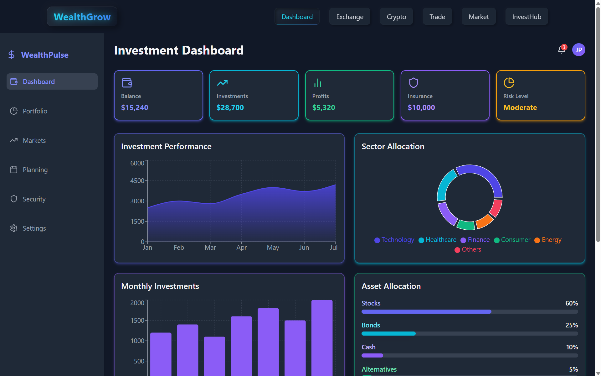
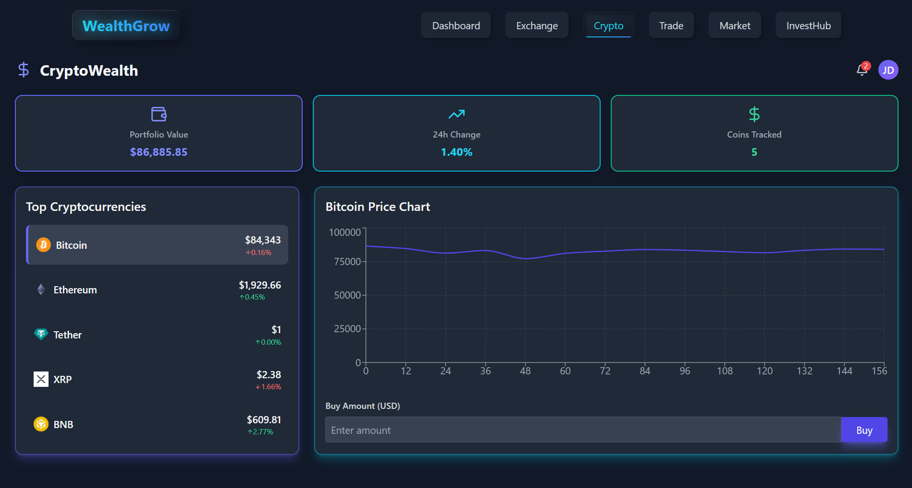
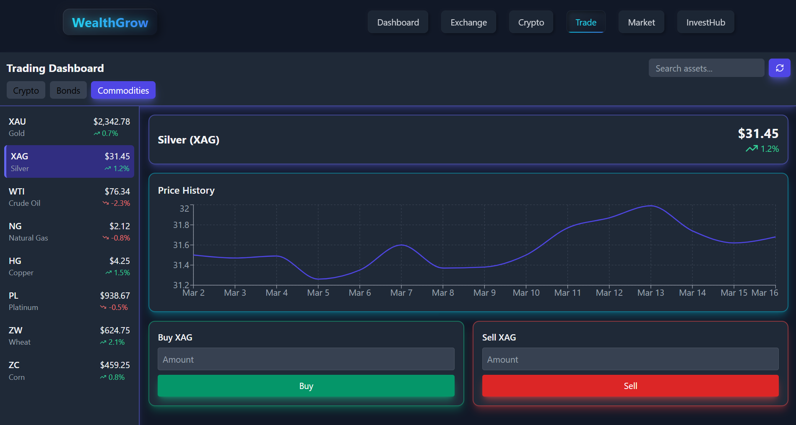
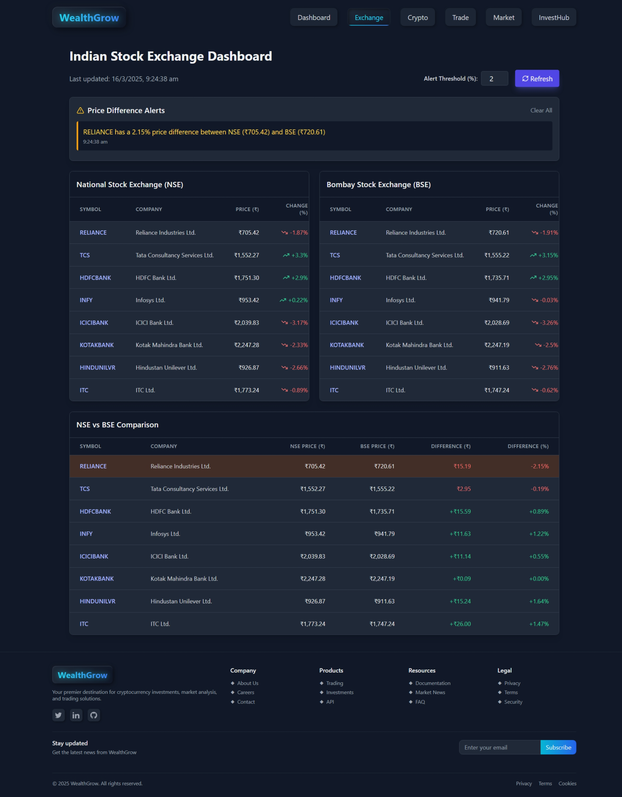
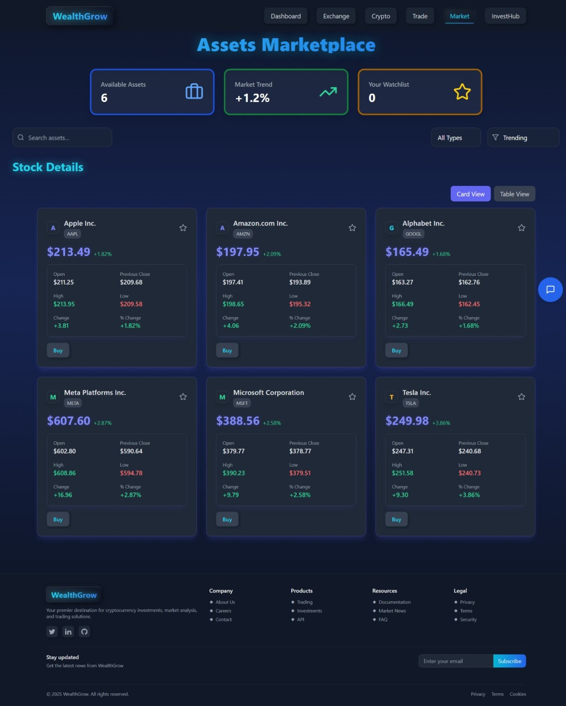
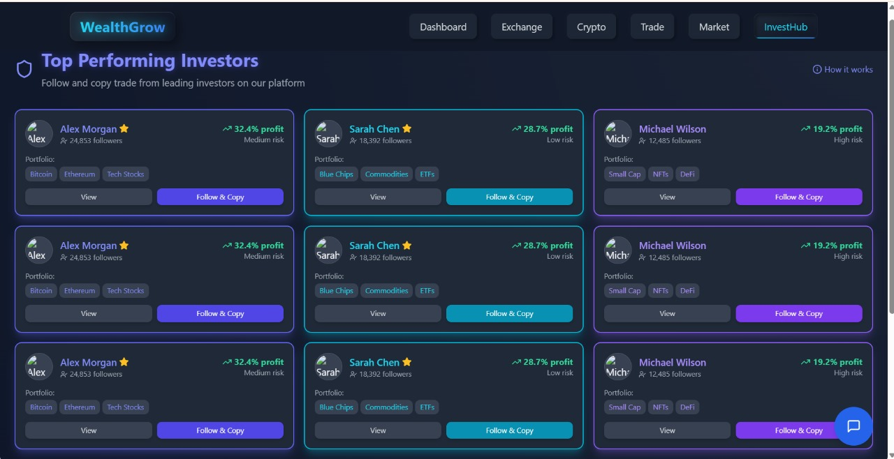

# Investment Portal

## Overview
The Investment Portal is a comprehensive financial management platform that allows users to manage various investments, including stocks, bonds, insurance, and cryptocurrencies. The application follows the **MVC (Model-View-Controller) design pattern** and provides a seamless user experience for tracking, buying, and selling assets while staying informed with real-time market data.

## Features
### **Investment Dashboard**
- Clean, intuitive interface for monitoring portfolio value.
- Asset allocation tracking across stocks, bonds, and other investments.
- Performance metrics displayed with simple graphs.
- Quick-action buttons for trades and transfers.
- Recent transaction logs and personalized market alerts.

  

### **CryptoWealth**
- Real-time cryptocurrency values and performance tracking.
- Market trend analysis with direct trade execution.
- Secure transactions with **2-step OTP verification**.
- Automated price alerts and complete transaction history.

  

### **Dynamic Real-Time Market Data**
- Live updates on **cryptocurrencies, bonds, and commodities**.
- Easy switching between asset categories and investment searches.
- Interactive price charts for historical performance analysis.
- Streamlined buy/sell panels for quick trade execution.
- **Visual indicators** highlighting price movements and trends.



### **Stock Market Monitoring**
- Dual monitoring of **NSE and BSE market data**.
- Complete stock metrics including price changes and trading volumes.
- Alert system for custom price threshold notifications.
- **Color-coded trend indicators** for quick assessment.
- **Arbitrage opportunity table** displaying price differentials.
- Automatic data refresh with manual update options.

  

### **Investment Exploration Tools**
- Search, filter, and sort investments by asset type, price, and performance.
- Personalized watchlist for tracking potential investments.
- Toggleable **card and table views** for flexible data visualization.
- **Gradient design** for enhanced user experience and emphasis on key metrics.

  

### **Financial Guidance and Insights**
- Personalized stock and market insights tailored to user goals and risk tolerance.
- **Technical market analysis** with easy-to-understand explanations.
- Investment decision support for both novice and experienced users.
- Market volatility management with balanced perspectives.

  

### **Social Investing & Copy Trading**
- Showcases a **curated selection of top investors** on the platform.
- Displays investor performance metrics, risk classifications, and portfolio highlights.
- Enables users to **follow and copy trades** from selected investors.
- Quick navigation to **detailed investor profiles**.
- Visual system for categorizing investors based on **risk level and performance**.

- 

## Tech Stack
- **Backend:** Django (REST Framework) / Node.js (Express)
- **Frontend:** React.js / Vue.js
- **Database:** PostgreSQL / MongoDB
- **Authentication:** JWT-based authentication with 2FA
- **Market Data:** Integration with real-time market data APIs (e.g., Alpha Vantage, Binance API)
- **Deployment:** AWS / Heroku / Docker

## Installation Guide
1. **Clone the repository:**
   ```sh
   git clone https://github.com/your-repo/investment-portal.git
   cd investment-portal
   ```
2. **Install backend dependencies:**
   ```sh
   cd backend
   pip install -r requirements.txt  # For Django
   npm install  # For Node.js (if applicable)
   ```
3. **Install frontend dependencies:**
   ```sh
   cd frontend
   npm install
   ```
4. **Set up environment variables:**
   Create a `.env` file and add required API keys and database credentials.
5. **Run the backend server:**
   ```sh
   python manage.py runserver  # For Django
   node server.js  # For Node.js (if applicable)
   ```
6. **Run the frontend server:**
   ```sh
   npm start
   ```

## API Endpoints
| Endpoint | Method | Description |
|----------|--------|-------------|
| `/api/investments` | GET | Fetch all investments |
| `/api/investments/{id}` | GET | Fetch a specific investment |
| `/api/trade` | POST | Execute a trade (buy/sell) |
| `/api/watchlist` | GET | Retrieve user watchlist |
| `/api/alerts` | POST | Set price alerts |

## Contribution Guidelines
- Fork the repository and create a new branch.
- Commit changes with meaningful messages.
- Submit a pull request with detailed descriptions of changes.

## License
This project is licensed under the **MIT License**.

